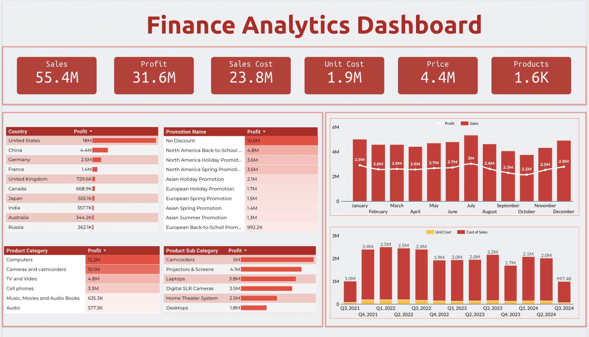

# Finance Analytics Dashboard in Looker Studio

[View Dashboard](https://lookerstudio.google.com/reporting/8075a8ff-7c06-4c9a-b208-7c8ae2eab582)

## Overview

This Finance Analytics Dashboard provides a comprehensive view of key financial metrics from 2021 to 2024. It offers insights into sales performance, profitability, and product analytics across different dimensions.

## Key Performance Indicators (KPIs)

- Sales
- Sales Cost
- Profit
- Unit Cost
- Price
- Products

## Data Visualizations

### Tables

1. **Country Profitability**
   - Breakdown of profit by country

2. **Product Category Profitability**
   - Profit analysis across different product categories

### Heatmap Tables

1. **Product Sub-category Profitability**
   - Heat map showing profit distribution across product sub-categories

2. **Promotion Name and Profit**
   - Heat map illustrating the relationship between promotion names and profit

### Time Series Charts

1. **Monthly Profit and Sales**
   - Combo chart (bar and line) showing monthly trends in profit and sales

2. **Quarterly Unit Cost and Cost of Sales**
   - Stacked chart displaying quarterly trends in unit cost and cost of sales

## Time Range

The dashboard covers data from 2021 to 2024, providing a multi-year perspective on financial performance.
